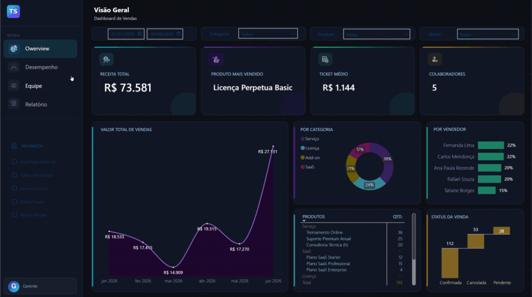
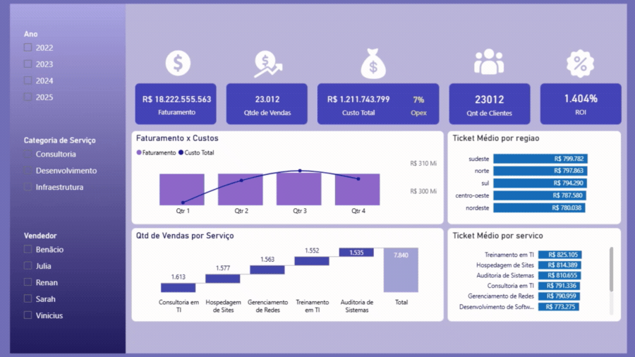

# 📊 Portfólio Power BI & Consultoria de Dados

  
  
  
  
  

Olá! Me chamo **Patricia Correia**, sou estudante de Sistemas de Informação e atuo como Analista Financeira e de Dados no desenvolvimento de soluções de Business Intelligence (BI).

Este repositório reúne meus projetos práticos e serve como vitrine para os meus serviços de **freelancer**. Transformo dados espalhados em planilhas e sistemas em painéis claros que apoiam a **tomada de decisão**. Se o seu negócio precisa enxergar melhor os próprios números, você está no lugar certo!

---

## 💼 Serviços Disponíveis (Freelance)
Disponível para projetos de curto e médio prazo:

* **Criação de Dashboards:** Relatórios visuais, interativos e automatizados.
* **Modelagem de Dados (ETL):** Tratamento e estruturação de bases de dados.
* **Integração de Fontes:** Conexão com Excel, bancos SQL, Web Scraping e APIs.
* **Otimização de Relatórios:** Melhoria de performance de planilhas e dashboards antigos.

---

## 🚀 Meus Projetos em Destaque

### 1. Dashboard de Performance Comercial (SaaS & Licenças)

> Painel de vendas para uma empresa de tecnologia, do faturamento macro ao desempenho individual da equipe.

* **🎯 Problema:** A gestão comercial não tinha visão única das vendas — quem vende mais, quais produtos puxam a receita e quantos negócios ficam pendentes ou são cancelados. Tudo dependia de consolidar planilhas manualmente.
* **💡 Solução:** Um dashboard interativo que centraliza tudo em uma tela, com filtros dinâmicos por período, categoria, produto, vendedor e status da venda.
* **📈 Resultados & Insights:** Revela em segundos o produto campeão, o ticket médio e a concentração de receita por vendedor, além de expor o funil de vendas (Confirmada x Pendente x Cancelada) para agir sobre negócios travados.
* **⚙️ Tecnologias:** Power BI, DAX, Power Query (M), Excel.
* **✨ Destaques técnicos:** KPIs de negócio, filtro de produtos com múltipla seleção, evolução mensal de vendas, análise por categoria (donut) e gráfico de cascata (Waterfall) para status.

**Visualização rápida:**

---

### 2. Dashboard de Controle Financeiro Empresarial

> Visão consolidada de receitas, custos e fluxo de caixa para decisões financeiras mais rápidas.

* **🎯 Problema:** Despesas e receitas espalhadas em fontes diferentes, sem uma visão única do fluxo de caixa nem comparação clara entre faturamento e custos.
* **💡 Solução:** Um painel integrado às planilha de controle que centraliza as movimentações financeiras e traduz os números em indicadores estratégicos.
* **📈 Resultados & Insights:** Mostra a saúde financeira do negócio de forma consolidada, compara faturamento x custos e permite simular cenários para apoiar decisões de corte de despesas e projeção de resultados.
* **⚙️ Tecnologias:** Power BI, Google Sheets, DAX.
* **✨ Destaques técnicos:** Integração com planilhas de controle em Google Sheets, indicadores estratégicos, análise de cenários e cálculo de ticket médio.

**Visualização rápida:**

---

## 🛠️ Habilidades Técnicas

* **BI & Visualização:** Power BI, DAX, Power Query (M).
* **Bancos de Dados & Planilhas:** SQL Server, Excel, Google Sheets.
* **Modelagem & Análise:** Modelagem de dados (ETL), análise financeira, modelagem de processos.
* **Base Acadêmica:** Sistemas de Informação.

---

## 📩 Vamos fechar negócio?
Gostou do trabalho e quer um orçamento **gratuito** para o seu negócio? Fale comigo:

  
  

---
*Analista Financeira e Estudante de Sistemas de Informação focada em gerar valor através de dados.*
